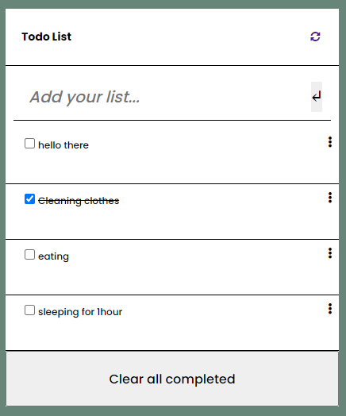

# Todo-list-project
"To-do list" is a tool that helps to organize your day. It simply lists the things that you need to do and allows you to mark them as complete. You will build a simple website that allows for doing that, and you will do it using ES6 and Webpack!

>View on the project

## Built With

 Major languages
- HTML
- CSS
- JAVASCRIPT

## Authors

👤 **Keza**

- GitHub: [Visit my github](https://github.com/keza681)
- Twitter: [Visit my twitter](https://twitter.com/LKeza19)
- LinkedIn: [Linkedin Profile](https://www.linkedin.com/in/linda-keza-a10150218/)

## 🤝 Contributing

Contributions, issues, and feature requests are welcome😉

## Show your support

Leave a ⭐️ if you like this project!

## Acknowledgments

- Hat tip to anyone whose code was used

## 📝 License

This project is [MIT](./MIT.md) licensed